# Projekt-z-zajec-projektowych-z-przedmiotu-Uklady-Elektroniczne
English below.   
Projekt wykonany na potrzeby zajęć projektowych z przedmiotu "Układy Elektroniczne"  
  
(Trwający projekt, jeszcze nie dokończony)

Założeniem projektu jest zaprojektowanie płytki PCB w której:  
- będzie znajdował się kontroler 32 bitowy sterujący pracą płytki,
- układ będzie wykorzystywał jeden rodzaj komunikacji,
- w układzie będzie znajdować się minimum jedno wyjście, do którego będzie podłączone urządzenie wyjściowe o poborze mocy przynajmniej 100 mA.

Dodatkowo płytka musi być wypsażona w dodatkowe elementy tak aby płytka była w stanie przejść (w teorii) testy typu burst, surge czy narazenia polem elektromagnetycznym.

Na potrzeby projekt, zaprojektowano płytkę rozszerzeń pod moduł WT32-ETH01. Który przy, pomocy oprogramowania typu open source jakim jest WLED, będzie sterowałem pracą podłączonych do niego poasków led-owych.  
  
Płytka została wyposażona w moduł SN74AHCT125 firmy Texas Instrumetns tak aby wyrównać poziomy sygnałów pomiędzy esp a paskiem led, wykorzystywane paski led opierają się o chip WS2815.  
  
Układ zawiera także moduł LM7805, ponieważ paski led oparte o WS2815 zasilane są napięciem 12V, a moduł WT32-ETH01 zasilany jest napięciem 5V, tak aby cały ukłąd można było zasilać jednym zasilaczem 12V.
  
Dodatkowo układ zawiera dwa wyjścia pod wentylatory chłodzące zasilane napięciem 12V, jeden chłodzący układ mikrokontrolera a drugi zasilacz, tak aby przy dłuższych okresach urzytkowania komponenty te chłodzić.

Układ zawiera rónież szereg diod diagnostycznych, które włącza się poprzez przesunięcie zworki w odpowiednie miejsca, mają one na celu wskazywanie czy do danego komponentu czy złącza napięcie dociera.    
  
Układ wyposażony został rónież w szereg punktów pomiarowych tak aby móc zmierzyć dokładną wartość napięcia którym zasilane są kluczowe elementy lub które występuje w kluczowych obszarach.  

Projekt ten oryginalnie powstał jako projekt hobbystyczny, gdyż w pokoju posiadam paski LED WS2815 i chciałem zaprojektować płytkę bazową, która będzie skupiała cały układ sterujący nimi w jednym miejscu. Zamiast zbioru komponentów elektronicznych połączonych między sobą i wrzuconych w pudełko, co też odbijało się na zakłócenia sygnału sterującego. Projekt ten zacząłem pod koniec ubiegłych wakacji, ale praca inżynierska miała większy priorytet więc go przerwałem. Teraz do niego powróciłem i wykorzystałem do jednych z zajęć projektowych. Całym układem steruje software open source o nazwie "Wled".  
  
Projekt ten nie zostął jeszcze ukończony, przez co brakuje wcześniej wspomnianych zabezpieczeń oraz schematy SCH oraz BRD nie są w pełni skończone.

Update:  
  - Poprawiony schemat WT32, dodane dodatkowe wyjścia
  - Dodane PWM do kontroli wentylatorów
  - Poprawiony schemat głównego zasilania
  - Dodany schemat wyjść  
  - Dodany wstępny schemat BRD (brak ścieżek, tylko rozkład elementów)  

Update 2:
  - Dodano diody transil
  - Dodano układ CD4060E wykorzystywany jako przekaźnik TON
  - Poprawiono rozłożenie komponentów na schemacie BRD
  - Poprowadzono część ścieżek na schemacie BRD

Update 3:  
  - Zmieniono połączenia w sekcji głównego zasilania  
  - Dodano rezystor 0 ohm w sekcji sterującej  
  - Zmieniono połączenia diod transil w sekcji wyjść  
  - Dodano dodatkowy radiator i otwór montażowy
  - Wszystkie ścieżki na schemacie BRD zostały poprowadzone  
    
English:  

(Ongoing project, not yet completed)  
The objective of the project is to design a PCB that includes:
  - a 32-bit controller responsible for controlling the operation of the board,  
  - the use of a single communication interface,
  - at least one output connected to a load drawing a minimum current of 100 mA.

Additionally, the board must be equipped with extra components to (theoretically) withstand tests such as burst, surge, and electromagnetic field immunity.  

For the purposes of this project, an expansion board was designed for the WT32-ETH01 module. Using open-source software such as WLED, it will control connected LED strips.  

The board is equipped with the SN74AHCT125 module from Texas Instruments to level-shift signals between the ESP module and the LED strip. The LED strips used are based on the WS2815 chip.  

The system also includes an LM7805 voltage regulator, since WS2815 LED strips are powered with 12V, while the WT32-ETH01 module requires 5V. This allows the entire system to be powered from a single 12V power supply.  

Additionally, the system includes two outputs for cooling fans powered at 12V — one dedicated to cooling the microcontroller and the other for cooling the power supply, ensuring proper thermal management during prolonged operation.  

The system also includes a set of diagnostic LEDs, which can be enabled by moving jumpers to appropriate positions. Their purpose is to indicate whether voltage is present at specific components or connectors.  

The board is also equipped with multiple test points to allow precise measurement of voltages supplied to key components or present in critical areas.  

This project originally started as a hobby project. I have WS2815 LED strips in my room and wanted to design a base board that would integrate the entire control system into one place, instead of having a collection of loosely connected components placed in a box — which also caused signal interference issues. I began this project at the end of last summer but paused it due to prioritizing my engineering thesis. Now I have returned to it and adapted it for one of my project-based courses. The entire system is controlled using open-source software called WLED.  

The project is not yet completed, and therefore the previously mentioned protections are still missing, and the SCH and BRD designs are not fully finalized.  

Update 1:  
  - Fixed WT32 schematic, added additional outputs  
  - Added PWM control for fans  
  - Improved main power supply schematic  
  - Added output schematics  
  - Added initial PCB layout (no routing yet, only component placement)

Update 2:  
  - Added TVS diodes  
  - Added CD4060E circuit used as a TON relay  
  - Improved component placement on the PCB layout  
  - Routed part of the PCB traces

Update 3:    
  - Connections in the main power section have been modified  
  - A 0-ohm resistor has been added in the control section  
  - Connections of the TVS diodes in the output section have been modified  
  - An additional heatsink and mounting hole have been added
  - All traces in BRD schematic have been routed  

Update 3:  

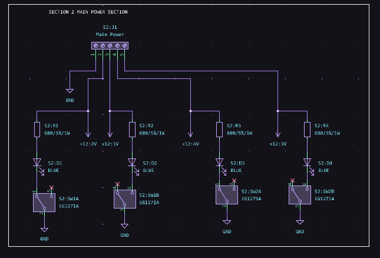  
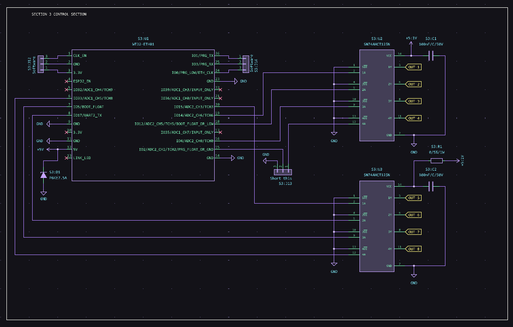  
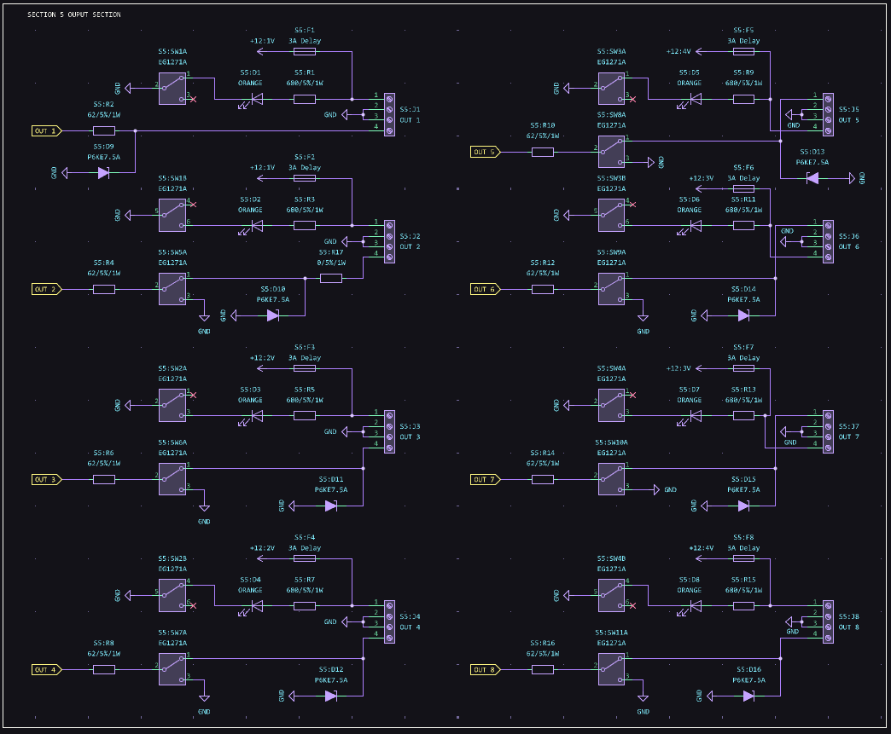  
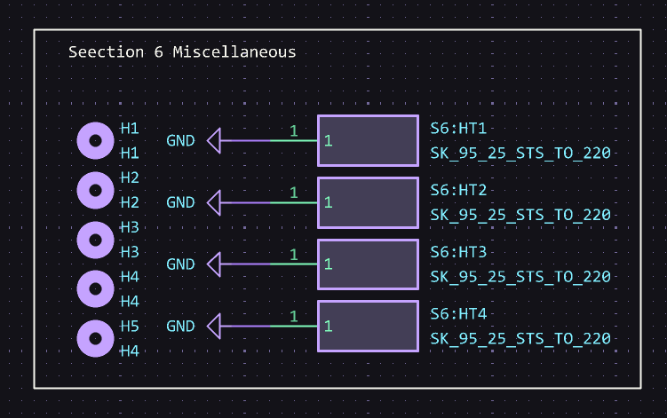  
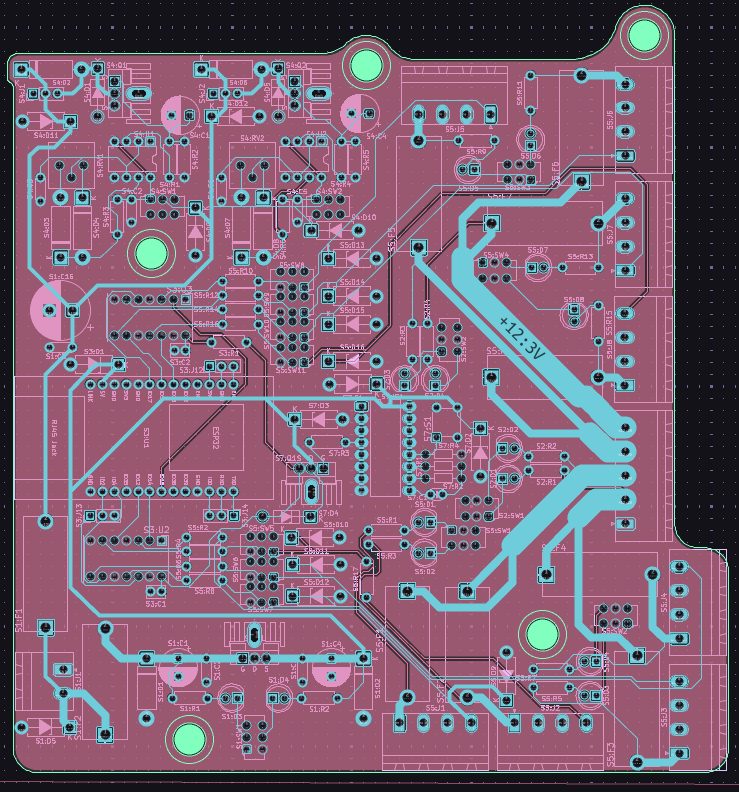
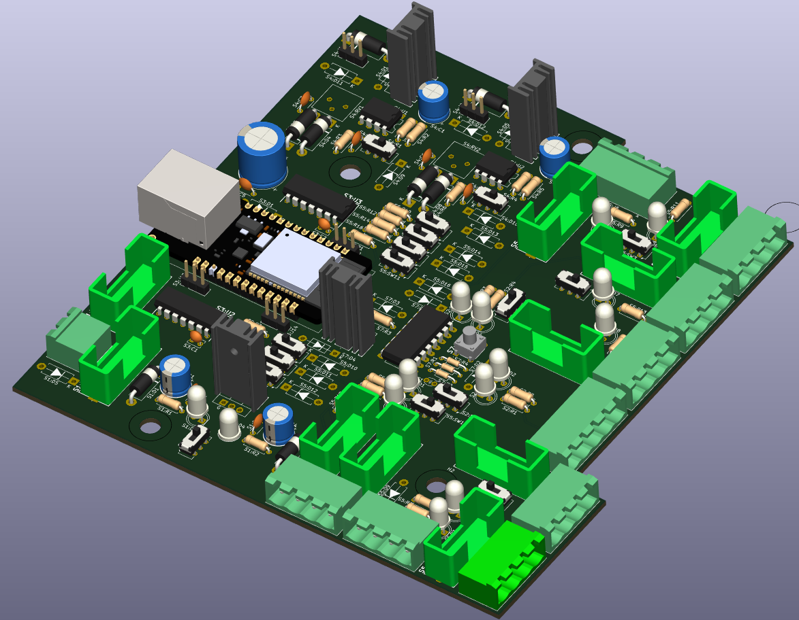  
  
Update 2:

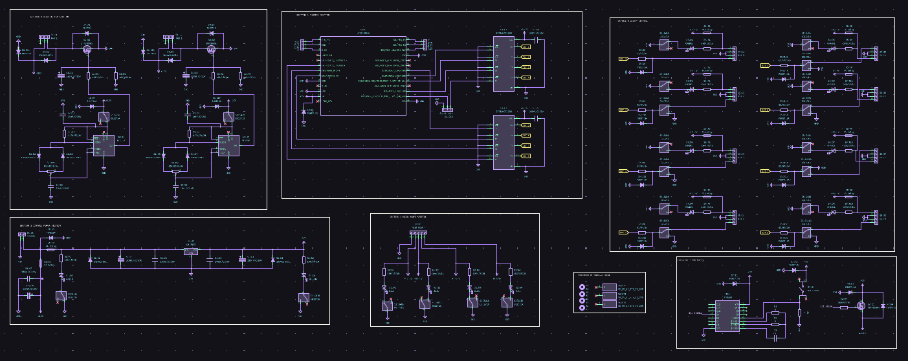
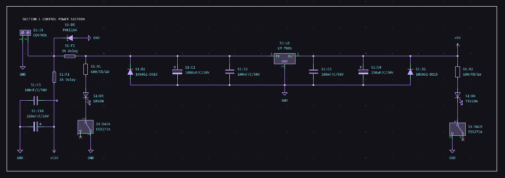
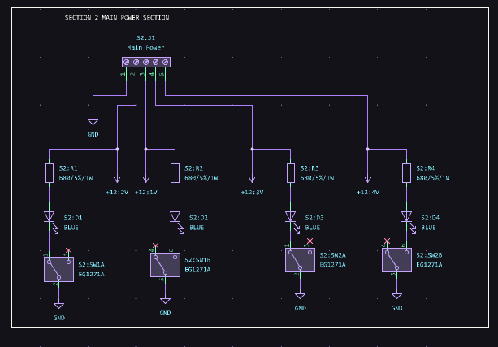

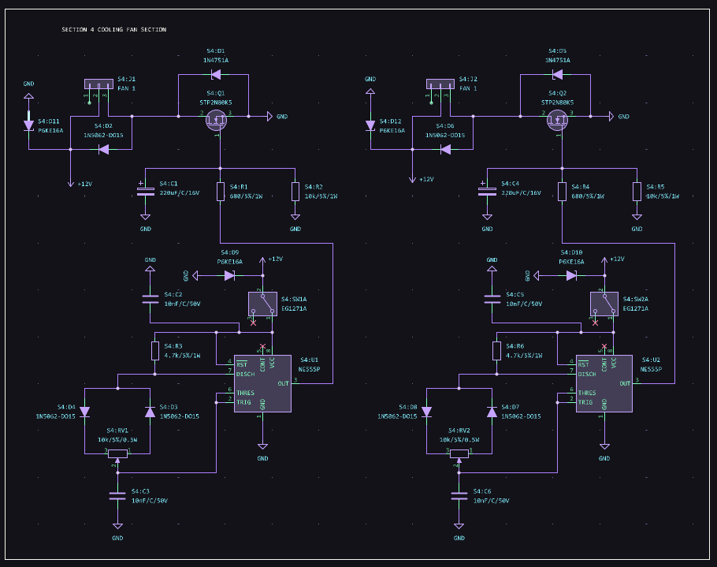
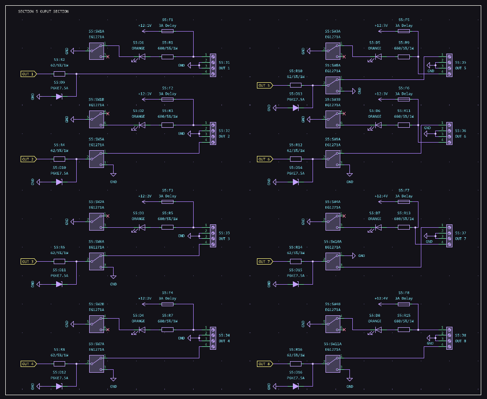
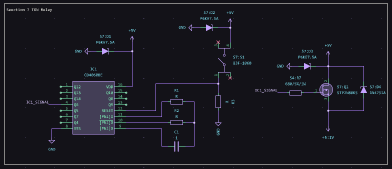
  
Update 1:
  
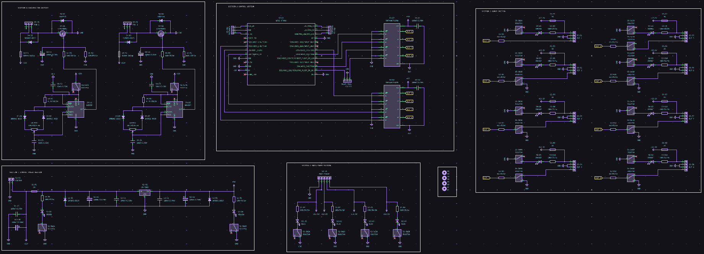
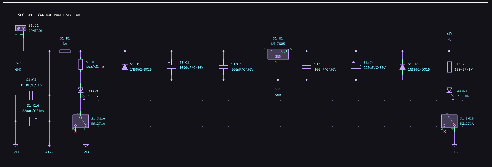
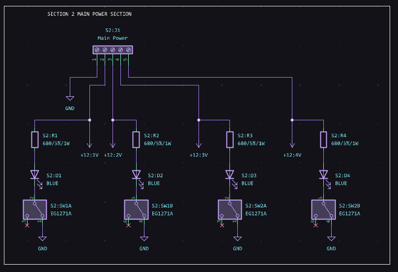
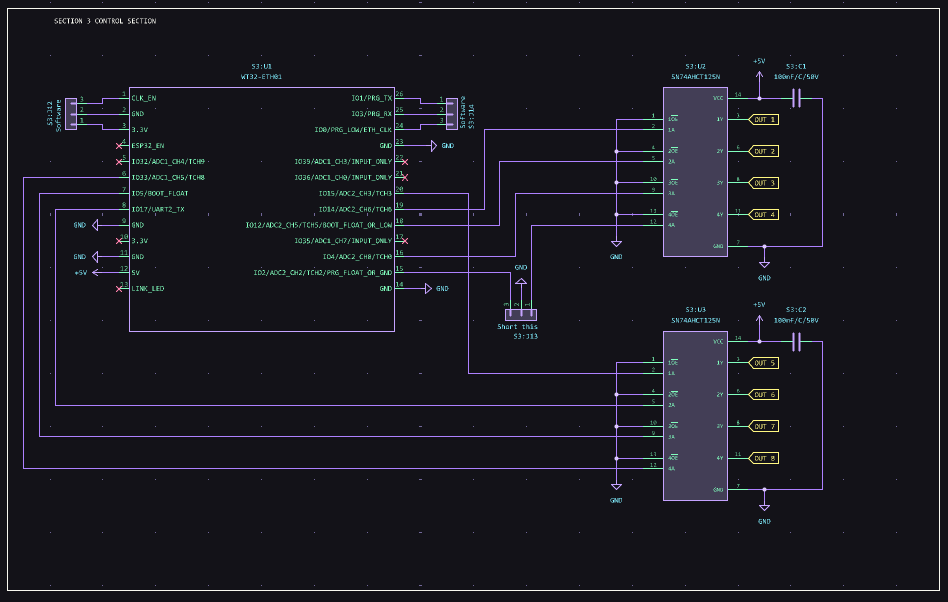
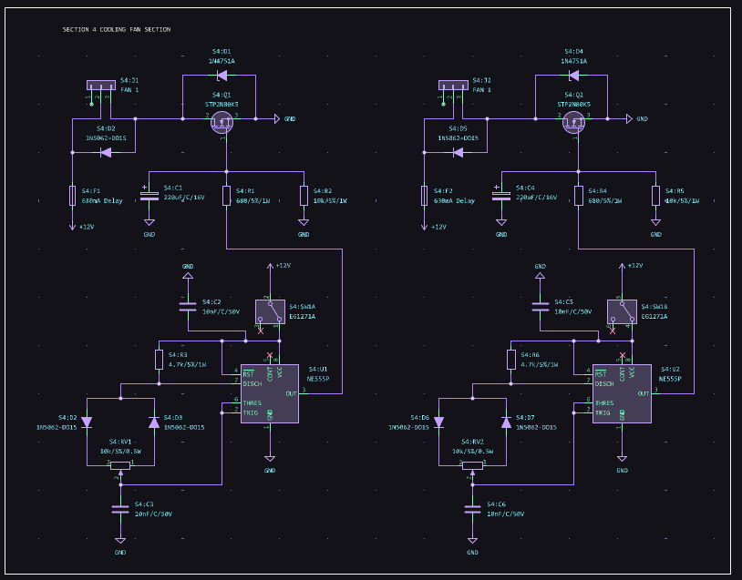
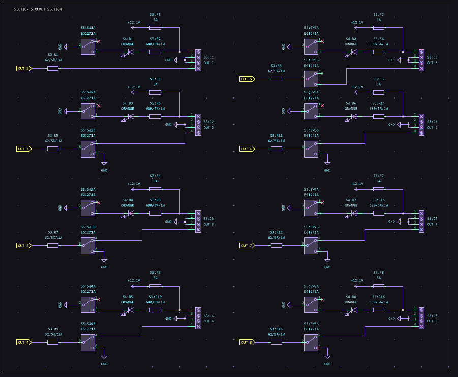
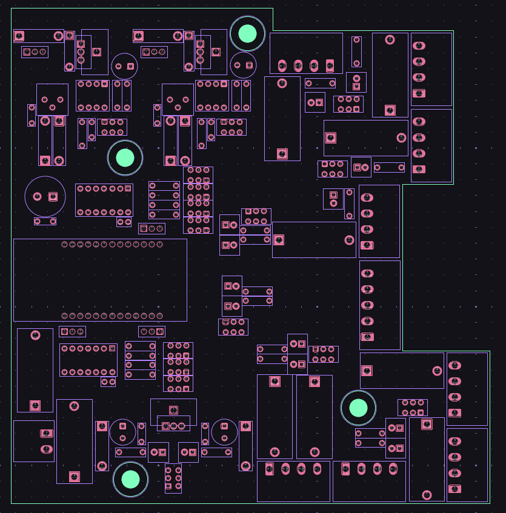
  
  
  
STARE WERSJE:
  
  
  

  
  
