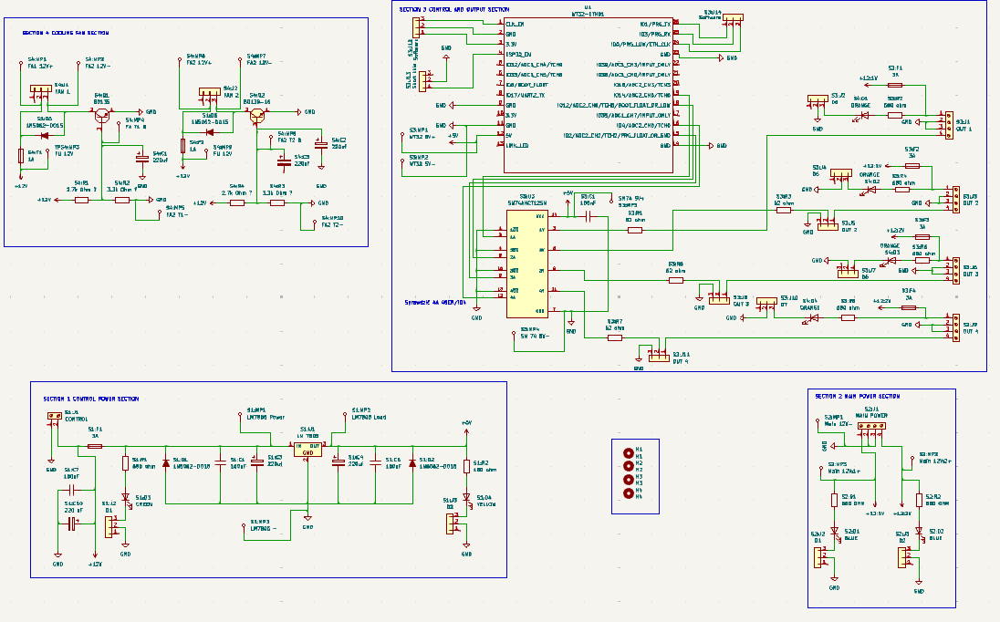
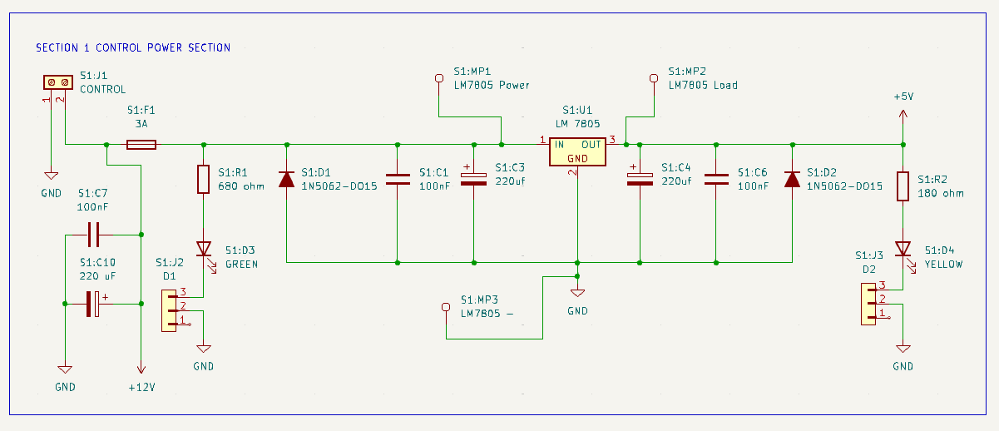
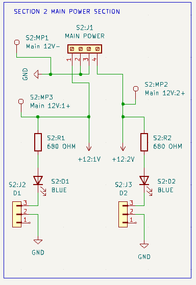
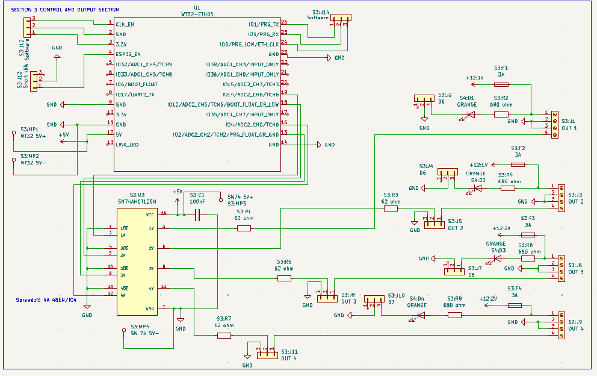
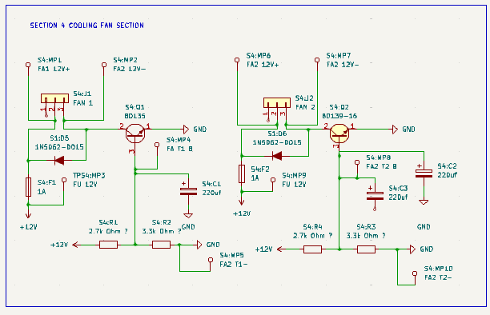
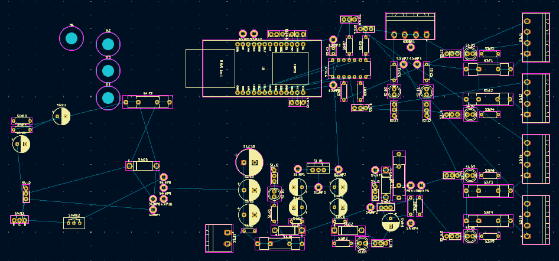

# Projekt-z-zajec-projektowych-z-przedmiotu-Uklady-Elektroniczne
Projekt wykonany na potrzeby zajęć projektowych z przedmiotu "Układy Elektroniczne"  
  
(Trwający projekt, jeszcze nie dokończony)

Założeniem projektu jest zaprojektowanie płytki PCB w której:  
- będzie znajdował się kontroler 32 bitowy sterujący pracą płytki,
- układ będzie wykorzystywał jeden rodzaj komunikacji,
- w układzie będzie znajdować się minimum jedno wyjście, do którego będzie podłączone urządzenie wyjściowe o poborze mocy przynajmniej 100 mA.

Dodatkowo płytka musi być wypsażona w dodatkowe elementy tak aby płytka była w stanie przejść (w teorii) testy typu burst, surge czy narazenia polem elektromagnetycznym.

Na potrzeby projekt, zaprojektowano płytkę rozszerzeń pod moduł WT32-ETH01. Który przy, pomocy oprogramowania typu open source jakim jest WLED, będzie sterowałem pracą podłączonych do niego poasków led-owych.  
  
Płytka została wyposażona w moduł SN74AHCT125 firmy Texas Instrumetns tak aby wyrównać poziomy sygnałów pomiędzy esp a paskiem led, wykorzystywane paski led opierają się o chip WS2815.  
  
Układ zawiera także moduł LM7805, ponieważ led-y oparte o WS2815 zasilane są napięciem 12V, a moduł WT32-ETH01 zasilany jest napięciem 5V, tak aby cały ukłąd można było zasilać jednym zasilaczem 12V.
  
Dodatkowo układ zawiera dwa wyjścia pod wentylatory chłodzące zasilane napięciem 12V, jeden chłodzący układ mikrokontrolera a drugi zasilacz, tak aby przy dłuższych okresach urzytkowania komponenty te chłodzić.

Układ zawiera rónież szereg diod diagnostycznych, które włącza się poprzez przesunięcie zworki w odpowiednie miejsca, mają one na celu wskazywanie czy do danego komponentu czy złącza napięcie dociera.    
  
Układ wyposażony został rónież w szereg punktów pomiarowych tak aby móc zmierzyć dokładną wartość napięcia którym zasilane są kluczowe elementy lub które występuje w kluczowych obszarach.  
  
Projekt ten nie zostął jeszcze ukończony, przez co brakuje wcześniej wspomnianych zabezpieczeń oraz schematy SCH oraz BRD nie są w pełni skończone.
  
  
  
  

  
  
